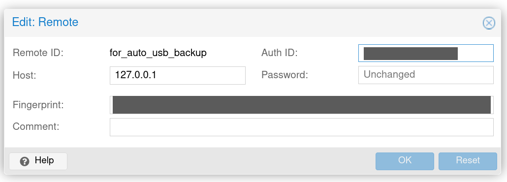

=======
pbs2usb
=======

An homemade python package to sync a Proxmox Backup Server to USB (or other devices).

Requirements
************

.. readme-requirements-start

- A formated drive. Can be empty or store a previous datastore, pbs2usb will treat it accordingly
- Manually create a remote called "for_auto_usb_backup" on ip 127.0.0.1 as shown below.

.. readme-requirements-end

Installation
------------

.. readme-install-start

pbs2usb can be installed using ``pip`` as follows:

.. code-block:: console

  $ python3 -m pip install pbs2usb

And if you want another layer of protection, in a virtual environment:

.. code-block:: console

  $ virtualenv venv
  $ source venv/bin/activate
  $ pip install pbs2usb
  #Run your commands in the virtual environment

  $ deactivate #to quit the virtual environment

.. readme-install-end

Usage
-----

.. readme-usage-start

.. code-block:: console

  #          disk----        ----datastore
  #                 |        |
  $ sudo pbs2usb /dev/sde1 backup_ds

Complete example
****************

We will first need the /dev/* id of the disk/partition/usb that we want to backup to.

.. code-block:: console

    $ lsblk --output NAME,SIZE,TYPE,TRAN,MOUNTPOINT
    NAME      SIZE TYPE TRAN MOUNTPOINT
    sda     558.9G disk sas  /datastore
    ├─sda1   1007K part 
    ├─sda2    512M part 
    └─sda3  558.4G part 
    sde       1.8T disk usb
    └─sde1    1.8T part

in that example we'll use the ``/dev/sde1`` partition. Best practice is to make sure the 
disk is not mounted. it can be unmounted by using ``sudo umount /dev/sde1`` if it is.

We also need the name of the datastore and optionally the namespace we want to backup.
In that example we'll just backup the whole ``backup_ds`` datastore

After that we issue the following command and everything should go flawlessly™

.. code-block:: console

  $ sudo pbs2usb /dev/sde1 backup_ds 

The workflow can be resumed as:
Mount drive -> Create Datastore -> Pull from existing -> Verify -> Unmount -> Delete temporary folder 

.. readme-usage-end

Optional Arguments
******************

These can be access with ``pbs2usb -h``

--namespace   [NAMESPACE] Specify a namespace to backup

--loglevel  [{CRITICAL,FATAL,ERROR,WARNING,WARN,INFO,DEBUG}] Logging level desired

--unattended          Remove the drive confirmation

--trustless           Will required confirmation at each step, Overwrite --unattended

--test                Will not run pull/verify on the datastore, use to test workflow

Donate 
------

.. readme-donate-start

I made this has a fun side project and it's free for anyone to use.
If you like it and wish to donate here's a few of my crypto wallets. 

.. _tbl-grid:

+----------------------------------------+--------------------------------------+-----------------------------------------+
| Ethereum and L2s (0x29006...)          | Monero (85tBS7YSrM5...)              | Peercoin (PBzj1ZwMDW...)                |
|                                        |                                      |                                         |
+========================================+======================================+=========================================+
| |EthereumQR|                           | |MoneroQR|                           | |PeercoinQR|                            |
+----------------------------------------+--------------------------------------+-----------------------------------------+

.. |EthereumQR| image:: https://raw.githubusercontent.com/SpeakinTelnet/pbs2usb/master/docs/_qrcodes/ethereum.png
  :width: 300
  :alt: EthereumQR

.. |MoneroQR| image:: https://raw.githubusercontent.com/SpeakinTelnet/pbs2usb/master/docs/_qrcodes/monero.png
  :width: 300
  :alt: MoneroQR

.. |PeercoinQR| image:: https://raw.githubusercontent.com/SpeakinTelnet/pbs2usb/master/docs/_qrcodes/peercoin.png
  :width: 300
  :alt: PeerCoinQR

.. readme-donate-end

* Free software: MIT

Disclaimer
----------

I'm in no way associated with Proxmox Server Solution and only made this script as
an helper for automatic workflow. Please properly test YOUR workflow before using
in production, or don't, I won't judge!

⊂(▀¯▀⊂)
